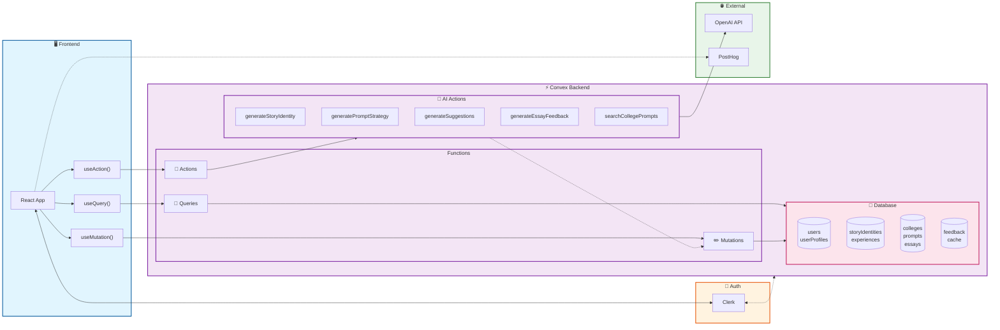

# Collee - MVP

Your personal admissions copilot.

## Project Structure
- `frontend/` Vite + React application.
- `frontend/src/main.tsx` App bootstrap (PostHog, Clerk, Convex, theme providers).
- `frontend/src/App.tsx` Route map for the SPA.
- `frontend/src/pages/` Route-level pages (`/`, `/screens`, `/sso-callback`).
- `frontend/src/components/` Shared components and UI primitives.
- `frontend/src/components/screens/` App screens used by the primary flow.
- `frontend/src/hooks/` Client hooks (notably `useStoreUserEffect`).
- `frontend/convex/` Convex backend functions (queries, mutations, actions).
- `frontend/convex/schema.ts` Convex data model.
- `frontend/convex/ai/` OpenAI-powered actions and prompt/deadline caching.
- `frontend/public/` Static assets.

## App Flow
1. Bootstrap in `frontend/src/main.tsx` creates providers for PostHog, Clerk, Convex, and theme.
2. Routing in `frontend/src/App.tsx`:
- `/` renders `pages/Index` (primary product flow).
- `/screens` renders `pages/ScreenShowcase`.
- `/sso-callback` handles Clerk auth callbacks.
3. Auth + onboarding in `pages/Index.tsx`:
- Clerk auth is checked, then `useStoreUserEffect` syncs the user into Convex.
- If `storyIdentity` exists or `userProfile.onboardingComplete` is true, go to `workspace`.
- Otherwise, the onboarding sequence runs.
4. Onboarding sequence in `pages/Index.tsx`:
- `welcome` → `resume` → `academic` → `diagnostics` → `writing-tone` → `personal-lens` → `reflection` → `loading` → `story-card` → `workspace`.
5. Workspace flow in `components/screens/ColleeWorkspace.tsx`:
- Manages college list, prompts, essays, story identity, feedback, exports, and sharing.
- Reads/writes data through Convex queries/mutations/actions in `frontend/convex`.
6. AI flow in `frontend/convex/ai/`:
- Generates story identity, prompt strategies, suggestions, and essay feedback using OpenAI.
- Searches and caches college prompts and deadlines.
- Stores results in tables defined in `frontend/convex/schema.ts`.

## Backend Architecture



### Request Flow

```
┌─────────────┐     ┌─────────────┐     ┌─────────────────────────────────┐     ┌─────────────┐
│   Browser   │────▶│    Clerk    │────▶│         Convex Backend          │────▶│   OpenAI    │
│  (React)    │◀────│   (Auth)    │◀────│  Queries │ Mutations │ Actions  │◀────│    API      │
└─────────────┘     └─────────────┘     └─────────────────────────────────┘     └─────────────┘
                                                       │
                                                       ▼
                                              ┌─────────────────┐
                                              │    Database     │
                                              │  (Convex DB)    │
                                              └─────────────────┘
```

### How It Works

| Layer | Technology | Purpose |
|-------|------------|---------|
| **Frontend** | React + Vite | UI components, routing, state |
| **Auth** | Clerk | User authentication, session management |
| **Backend** | Convex | Serverless functions (queries, mutations, actions) |
| **AI** | OpenAI GPT | Story generation, essay feedback, prompt matching |
| **Database** | Convex DB | Real-time synced document store |
| **Analytics** | PostHog | User behavior tracking |

### Key Data Flows

1. **Auth Sync**: Clerk JWT → `useStoreUserEffect` → Convex `users` table
2. **Real-time Reads**: `useQuery()` subscribes to Convex queries → auto-updates UI
3. **Writes**: `useMutation()` → Convex mutation → DB update → triggers query refresh
4. **AI Generation**: `useAction()` → Convex action → OpenAI API → saves via mutation

## Data Model (Convex)
- `users`, `userProfiles`, `storyIdentities`
- `colleges`, `prompts`, `essays`, `essayVersions`
- `experiences`, `storyPillars`, `personalLensNotes`
- `storySuggestions`, `promptStrategies`, `essayFeedback`
- `cachedCollegePrompts`, `cachedCollegeDeadlines`, `essayExcerpts`, `experienceUsages`

## Environment
- `OPENAI_API_KEY` for AI actions in Convex.
- `VITE_CONVEX_URL` from your Convex deployment.
- `VITE_CLERK_PUBLISHABLE_KEY` for Clerk auth.
- `VITE_PUBLIC_POSTHOG_KEY` and `VITE_PUBLIC_POSTHOG_HOST` for analytics.

## Local Development
1. `cd frontend`
2. `npm install`
3. `npm run dev`
4. Open `http://localhost:8080`
