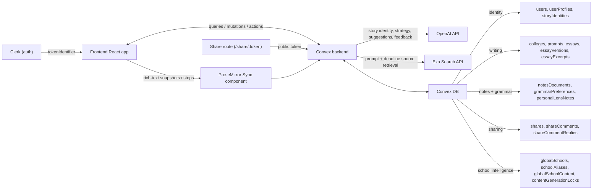

# Collee

Your personal admissions copilot.

Collee helps students manage college essays end-to-end: onboarding, college and prompt planning, writing, AI guidance, reviewer collaboration, and export.

## Material Changes Reflected In This README

- Dashboard-first workspace architecture (`DashboardShell` + `EssaysSection`) is now the primary in-app experience.
- Essay editing is fully rich text with Tiptap + Convex ProseMirror sync, including sync-generation resets after external share edits.
- Assistant tooling is now split into strategy, feedback, reviewer comments, and grammar analysis (Harper-based) with saved user grammar preferences.
- Notes moved to first-class `notesDocuments` with migration support from personal lens notes and AI context ingestion.
- School data enrichment is now canonicalized (`globalSchools`, `schoolAliases`) and quality-scored (`globalSchoolContent`, `contentGenerationLocks`) via Exa + OpenAI.
- Share flow remains token-scoped (`view` / `comment` / `edit`) with comment replies and owner resolution workflows.

## Project Structure

- `frontend/`: Vite + React + TypeScript app.
- `frontend/src/main.tsx`: provider bootstrap (PostHog, Clerk, Convex, Theme).
- `frontend/src/App.tsx`: routes (`/`, `/screens`, `/sso-callback`, `/share/:token`).
- `frontend/src/pages/Index.tsx`: auth gate, onboarding flow, workspace entry.
- `frontend/src/components/dashboard/`: dashboard shell, sidebar, deadlines/progress views.
- `frontend/src/components/essays/`: modular essay workspace (editor, AI assistant, sharing, history, grammar).
- `frontend/src/components/editor/SyncEssayEditor.tsx`: Tiptap editor wired to sync/doc lifecycle.
- `frontend/src/lib/richText.ts`: rich-text parsing, rendering, and plain-text extraction.
- `frontend/convex/`: backend queries, mutations, and node actions.
- `frontend/convex/convex.config.ts`: Convex app config with `@convex-dev/prosemirror-sync`.
- `frontend/convex/prosemirror.ts`: sync APIs, snapshot hooks, sync generation reset.
- `frontend/convex/schema.ts`: full Convex schema.

## App Flow

1. Bootstrap (`frontend/src/main.tsx`)
   - Initializes Clerk, Convex, PostHog, and theme providers.
2. Routing (`frontend/src/App.tsx`)
   - Main app at `/`, share surface at `/share/:token`.
3. Auth + onboarding (`frontend/src/pages/Index.tsx`)
   - Clerk identity syncs into Convex (`useStoreUserEffect`), then user proceeds through onboarding or directly to workspace.
4. Main workspace (`frontend/src/components/dashboard/DashboardShell.tsx`)
   - Dashboard summary and essay workspace navigation.
5. Essay workspace (`frontend/src/components/essays/EssaysSection.tsx`)
   - Rich-text editor, autosave/sync, version history, smart reuse, AI strategy/feedback, grammar, sharing.
6. Share route (`frontend/src/pages/SharePage.tsx`)
   - Token-resolved permission mode: `view`, `comment`, or `edit`.

## Backend Architecture

## Rich-Text + Sync Notes

- `essays.content` is stored as normalized ProseMirror JSON (string).
- Legacy plain-text/markdown-like input is normalized for compatibility.
- Word count and status are derived from plain text extracted from rich text.
- `prosemirror.onSnapshot` updates essay metadata, throttled version history, and smart-reuse excerpts.
- `prosemirror.resetDocument` rotates sync generation after external edits (for example from share links) to avoid stale sessions.

## Data Model (Convex)

Core tables include:

- Identity: `users`, `userProfiles`, `storyIdentities`
- Writing: `colleges`, `prompts`, `essays`, `essayVersions`, `essayExcerpts`
- Experiences and planning: `experiences`, `storyPillars`, `storySuggestions`, `promptStrategies`, `experienceUsages`
- AI feedback: `essayFeedback`
- Notes and grammar: `notesDocuments`, `personalLensNotes`, `grammarPreferences`
- Sharing: `shares`, `shareComments`, `shareCommentReplies`
- School enrichment and cache: `globalSchools`, `schoolAliases`, `globalSchoolContent`, `contentGenerationLocks`, `cachedCollegePrompts`, `cachedCollegeDeadlines`

## Environment Variables

Backend/Convex actions:

- `OPENAI_API_KEY`
- `EXA_API_KEY` (required for school prompt/deadline enrichment)

Frontend:

- `VITE_CONVEX_URL`
- `VITE_CLERK_PUBLISHABLE_KEY`
- `VITE_PUBLIC_POSTHOG_KEY`
- `VITE_PUBLIC_POSTHOG_HOST`

## Local Development

1. `cd frontend`
2. `npm install`
3. Start Convex: `npx convex dev`
4. Start frontend (new terminal): `npm run dev`
5. Open [http://localhost:8080](http://localhost:8080)
